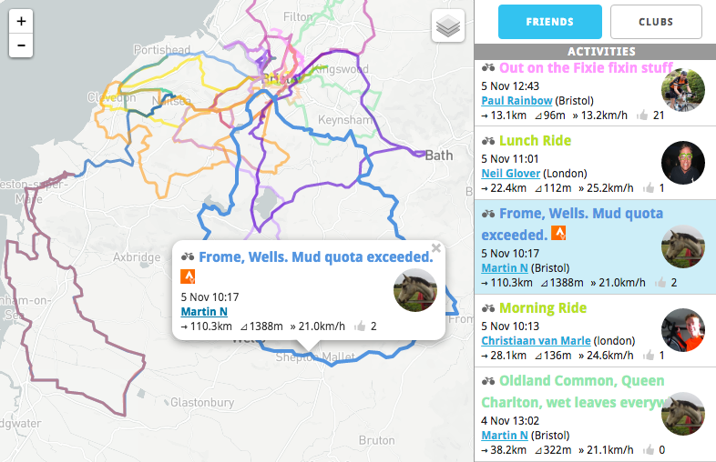

# Stravamap

[Live version](http://http://stravamap.marthost.uk/)

Stravamap is a webapp which displays [Strava](https://www.strava.com/) ride/run data from you, your friends and your clubs, together on a single map.

I like to think of it as an alternative, visual-first way to consume your Strava feed.

## Prerequisites for use

You need to have a [Strava](https://www.strava.com/) account and authorise access by Stravamap (you will be prompted on page load; it's a one-click operation if you are already logged in to Strava).

If you're not on Strava, you can still browse the app which features one club.

## Purpose

Created simply to explore the Strava API and learn about webapps, the app has become something I now find useful and regularly consult. Anyone is welcome to use the [live version](http://http://stravamap.marthost.uk/) for their own purposes, or alternatively clone and explore the repo for educational purposes.

This repo is non-commercial and is provided as-is for no other purpose than entertainment, education and curiosity. Fork it, play with it, inspect it, but don't do anything that depends on it.

## Technologies used

* [Leaflet](http://leafletjs.com/) - for the nice interactive map
* [Strava API wrapper](https://github.com/iamstuartwilson/strava) by Stuart Wilson

## Project status

More or less completed, stable, more features may still be added.

#### Ideas

* Add kudos & comments
* Show multiple riders riding together
* Activity start/end markers

## Contributing

This project is not looking for contributions, but any [issues](issues/) created (bugs, ideas) will be addressed.

## License

This project is licensed under the MIT License.
